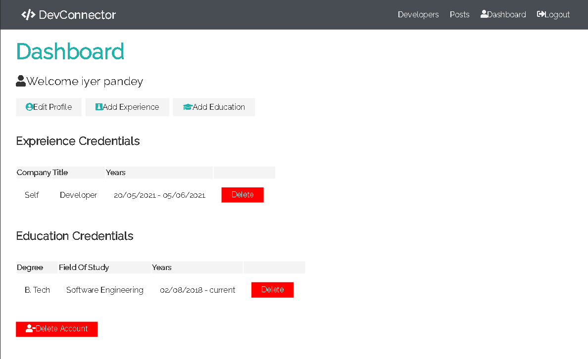
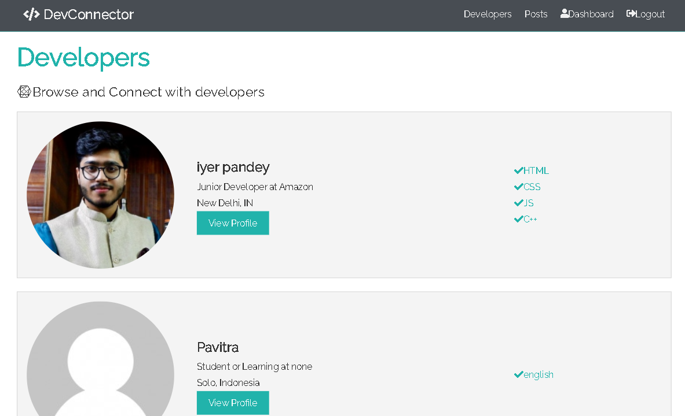
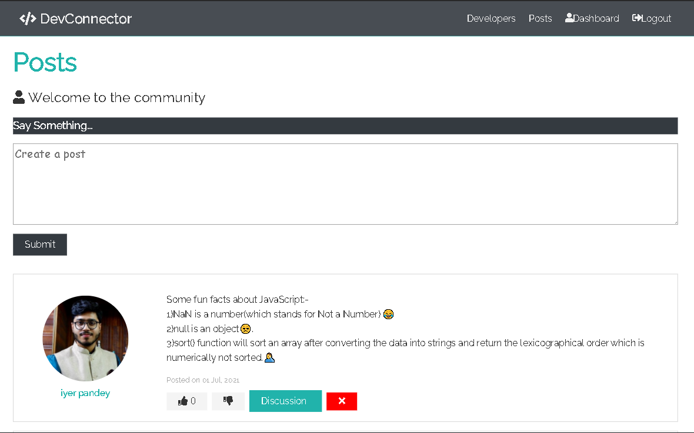

# Dev Connector

A platform for developers to connect. They can create their portofolio by adding their experience, education, skills and other important information of their professional career.

Users can also create small posts and like/dislike and comment on other posts.

Live link: <a href="https://warm-anchorage-02588.herokuapp.com/" target="_blank"> Click here</a>

---

---

---

---

---

## Main Technologies

### Client Side

- [x] **[React](https://github.com/facebook/react)**
- [x] **[Redux](https://github.com/reactjs/redux)**
- [x] **[React-Router-DOM](https://github.com/ReactTraining/react-router/tree/master/packages/react-router-dom)**

#### Libraries used in Client-side

- [x] **[axios](https://github.com/axios/axios)**
- [x] **[react-moment](https://github.com/headzoo/react-moment)**
- [x] **[react-redux](https://github.com/reduxjs/react-redux)**
- [x] **[redux-thunk](https://github.com/reduxjs/redux-thunk)**
- [x] **[validator](https://github.com/chriso/validator.js)**

### Server Side

- [x] **[Node.js / Express](https://github.com/expressjs/express)**
- [x] **[MongoDB](https://github.com/mongodb/mongo)**
- [x] **[JWT](https://github.com/auth0/node-jsonwebtoken)**

#### Libraries used in Server-side

- [x] **[bcryptjs](https://github.com/dcodeIO/bcrypt.js)**
- [x] **[gravatar](https://github.com/emerleite/node-gravatar)**
- [x] **[mongoose](http://mongoosejs.com/)**
- [x] **[jwt-decode](https://github.com/auth0/jwt-decode)**
- [x] **[moment](https://momentjs.com/)**
- [x] **[validator](https://github.com/chriso/validator.js)**
